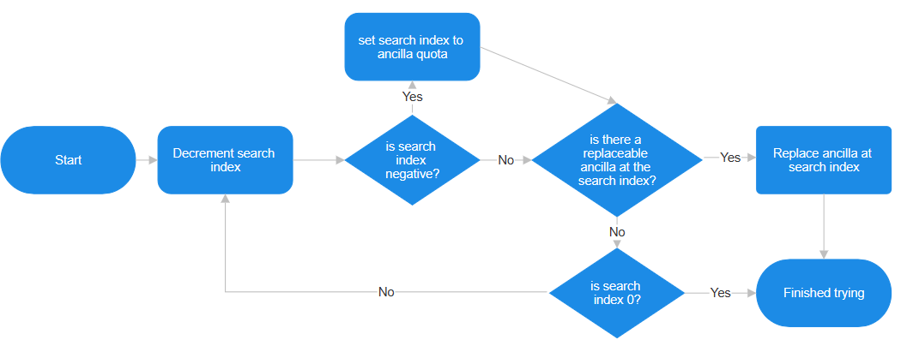

# Three Ways of Looking At Ancilla Replacement

I just wrote up the ancilla replacement algorithm 3 different ways, in the hopes that they might help different people.

If you're a particular kind of person, you might also find [the code](https://github.com/spannerisms/jpdasm/blob/master/bank_1C.asm#L14033) interesting.

## Prose

There is a variable that we call the **search index**.

When an ancilla is looking for another ancilla that it can replace, it first decrements the search index, and then if the search index is negative, it is set to the spawning ancilla's quota - 1 (i.e. if you can have 2 of something, it will set the search index to slot 1).

Then the slot indicated by the search index is checked. If it contains a replaceable ancilla, the spawning ancilla spawns in at this slot, replacing the replaceable ancilla, and we're done. If the search index is `0`, we're also done. Otherwise, we continue this process, starting with the decrement.

## Pseudocode

```
while True:
    search_index = search_index - 1
    if search_index < 0:
        search_index = ancilla.quota - 1

    if ANCILLAE[search_index] is replaceable:
        spawn ancilla at search_index
        break
    if search_index is 0:
        break
```

## Flowchart



