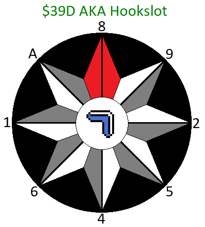

(all info credit to Tojso and vZakat)

-----

Tojso: Somaria-less Hookpushing is really just 2 things:

1) Get a stuck hook in slots 0-4
2) Ancilla overload a hook

To get a stuck hook, you simply need to change link's state while the hookshot is extending toward a hookable object. There are a few ways to do this.

Easiest is known as hookshopping, where you purchase a shop item while the hook is extending. This is limited to shops, so not very useful in rando, but useful for getting other variations down. https://twitter.com/linus0505/status/1419156698367856643

Most commonly, you'll use a misslotted hook (any slot 5-9), then a regular hook (any slot 0-4) immediately after at the same object. The misslotted hook will hit the hookable object first, which changes Link's state before the regular hook reaches its target. There is some fuzzyness here as sometimes the regular hook will also retract and I'm not 100% sure what causes it.

Lastly, there is potential to use Lonk with a regular hook as you can move a little while using items with Lonk.

[4:53 PM] Tojso: The most important variable from here is $39D (view this in prachack using the Hookslot for one of the Sentries in the HUD extras). When a hookshot is thrown or hits a hookable object, the slot of the hookshot will be written to $39D. 

To activate the hookpush, we need to use the hookshot, but a newly spawned hookshot will just overwrite $39D with whatever slot it's occupying. To get around this, we use ancilla overload (think splash-delete). We use the hookshot while slots 0-4 are filled, thus a new one doesn't actually spawn, so the game just uses whatever was left over from $39D and the associated variables from that slot.

You do need to be a bit careful, though. If your index is 0 before throwing the last hook, it can replace particles in slots 1-3, just like shooting arrows does.

Ultimately, this version of hookpushing is more a like a translation of an existing hook you could do in the supertile.

[4:53 PM] Tojso: However, we can use different distances and directions by modifying $39D before throwing the last hook. $39D is also used by the boomerang, depending on the direction you throw it: (8 for N, 9 for NE, 1 for E, 5 for SE, 4 for S, 6 for SW, 2 for W, and A for NW).

---

 Tojso: using the boomerang allows you to use stuff from a slot other than the one for your stuck hook. so in the powder-pushing example, I misslotted a beam to slot 5 while throwing the boomerang to set $39D to 5. so, when I ancilla overload the hook, the game looks at stuff only from slot 5.  
[5:14 PM] FoxLisk: yeah  
[5:14 PM] Tojso: it can be tricky to get the timings down when using boomerang to change $39D to something within 0-4  
[5:14 PM] FoxLisk: so when we shoot the hookshot that doesn't actually spawn  
[5:15 PM] FoxLisk: it looks at whatever the ancilla index indicated by $39D is  
[5:15 PM] FoxLisk: and looks at what the prachack calls the "extension" value  
[5:15 PM] FoxLisk: and hookpushes us for that many frames  
[5:15 PM] FoxLisk: right? (direction is still a mystery to me)  
[5:15 PM] Tojso: correct, direction is also taken from the same slot from $39D  
