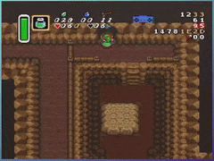
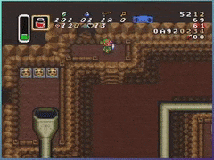
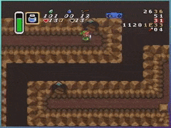

**Stairmaster** is the name of a glitch found by **ZeroK_Dragon** on or around October 31, 2022. [This is his original discord post](https://discord.com/channels/307860211333595146/336125937605148672/1036822049462698055).

Stairmaster allows you to hit a spiral staircase in a funny way, which deposits you on the other end of the transition in a funny place. In particular, on staircases going _up_, you end up close enough to the top of the the screen to hit the north transition.

It requires a drinkable potion and the boots.

# How to:

   1. Go to an up staircase until the next up input walks you up the stairs
   2. "YBA" north (that is, equip a drinkable potion and press Y+^ on the same frame)
   3. Slash and hold your sword out
   4. Hold < and tap A. This will trigger a stair transition.
   5. Pressing v after the transition will kick you to the north transition.

You can hold v through the transition. There is no timing consideration.

# What is it good for?

There are three known applications. There are also mp4s [in this directory][.] if you prefer those.

## Spectacle Rock -> Eastern

The good pixels for the "YBA" are Y-E21 and Y-E20.

## Turtle Rock -> Moldorm 2

You can bonk into the doorway to line up for the "YBA".

## Superbunny Cave -> Eastern

If you mirror erase, the trick won't work. I don't know why.

You can bonk into the doorway to line up for the "YBA".

# Minutiae

## Bottleless

Hotarubi has come up with a bottleless setup. It involves arming EG to get what is colloquially known as _stair succ_. I don't fully understand this yet or know if it's good for anything. [See his message and some discussion here](https://discord.com/channels/138378732376162304/280990969363562496/1037866964451856395)

## Less useful diagonal stairs

You can do this in downwards staircases, or move > instead of < to trigger the transition. These take you to less useful destinations. They also make Link invisible, which is weird. It's not EG though, I promise.
