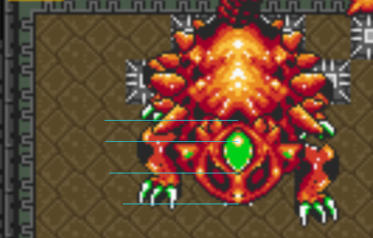
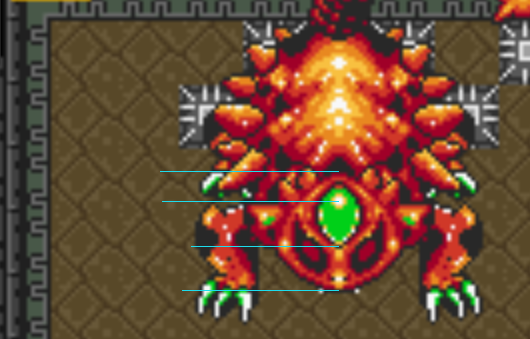
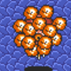
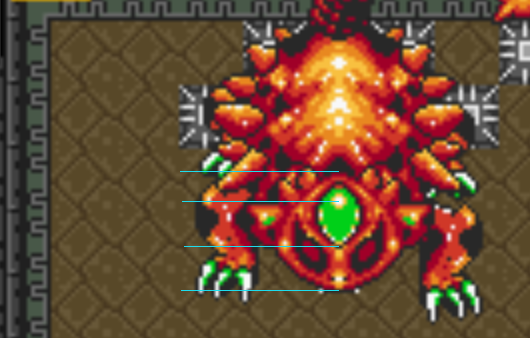
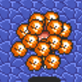

## Note

This is all taken from [pinkus](https://github.com/helgefmi)'s work. I am rehosting here to make it easier to read. [Original source here](https://pastebin.com/vD6JLmVJ).

---

Short version:

This method _can_ detect a splice somewhere between killing Helmasaur and entering Arrghus.

Basically, look at bottom left leg of Helmasaur right after he's killed (pngs for all 9 patterns are [here](.)). If it ends up being 00.png, 02.png, 04.png, 06.png or 08.png, Arrgi pattern should be similar to arrghus_even.png. And 01, 03, 05 and 07 should yield something similar to arrghus_odd.png.

There used to be info here about using Helmasaur's top-left leg to check precise positions of arrghus's puffs. It is my current belief that that information was incorrect, and it has been removed.

Technical info:

- Depending on 0B08[2] and 0B0C[1], you will get different Arrgi configurations at the start of the Arrghus fight.

- If 0B0C is non-zero (which it should always be, it's set to $A0 in the hookshot room, and nothing touches the memory address after that) you should get one specific pattern upon entering Arrghus room, and then right before puffs starts rotating smoothly, it should do a quick rotation for about 112.5 degrees (little more than 90 degrees). Most ppl have probably seen this, that they change from one configuration to another right before the start of the fight. If this doesnt happen its a splice for sure - though it would be a weird splice, since it meant they spliced between entering hookshot room and Arrghus.

- 0B08 and 0B09 is set between 0 and 8, depending on the location of the left legs of Helmasaur when he's killed. This is not touched until you enter Arrghus, so if someone splices between Helma and Arrghus, we can sometimes detect it, though there is always the chance they happened to kill Helmasaur with the same leg configuration in 2 different runs.

- 0B08 is top left leg, 0B09 is bottom left leg. Value of 0 means they are at the top, 8 means they are at the bottom.

- If Helma is standing still when he's killed, they will either be 0 or 8. If he's moving when he gets killed, you can get other values between 0 and 8 too.

- For 0B09 (bottom left leg), the only thing that matters is if the number is even or odd. If it's an odd number, puffs will be 180 degrees rotated vs if it's an even number, so this is a big change and noticable even on bad quality vods. So if someone kills helmasaur while he's standing still (meaning 0B09 is even, since its either 0 or 8) you will get vastly different Arrgi patterns from what would be possible if you kill him while he's moving. But it needs more work if you want to do it the other way, because the value could be 2, 4 or 6 in which case you get the same result as if he's standing still.

---

# Even patterns:

## Helma:

00

02

04

06

08

## Arrghus:

# Odd patterns

## Helma:

01

03

05

07

## Arrghus:

