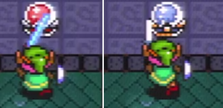
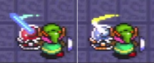

# How Long Is My Sword?

I'm not going to give you a straight answer to this question, in part because it doesn't matter, and in part because I don't feel like digging into the disassembly for exact pixels distances relative to the top-left pixel of Link's hitbox or whatever.

What I'm going to address instead is some misconceptions about the _difference_ between the length of various swords.

# Misinformation

Anyone who knows me will tell you: I *love* misinformation. However, I need to clear some things up. It's very common to hear things like 

> Each sword is 1 pixel longer than the one before

but that's just not true.

# A Grain Of Truth

What _is_ true is that not all swords are created equal. The slash is... different if you have at least Master Sword. All three upgraded swords have the same range, and the poke, dash, and spin hitboxes are unaffected.

## Different how?

Well. I'm not sure. Here are some facts that need to be reconciled. This testing was done in Hera lobby.

## Fact 1

If you stand on (F0C,F7A-F7D) (Immediately to the right of the switch), the FS slash hits the switch but other swords don't.

## Fact 2

If you stand on (F03,F9F-F9A) (Immediately below the switch), MS+ hits and the FS doesn't.

## Fact 3

The FS and MS+ swords hit the switch at slightly different parts of their animations.

From below:

## Synthesis

The sword slash has a [number of separate hitboxes](../images/hitboxes/slashes) that it iterates through over the course of the slash. They sort of follow the motion of the sword swing.

I think given that Fact 1 implies a hitbox offset of 

2. If you stand on (F0E-F18,F91) (below and to the right of the switch), the MS+ slash hits the switch and the FS misses. This implies 10 pixels of added horizontal range from the MS+ slash.

In typical ALttP fashion, that depends on what direction you're facing. I don't 

[0] Extra hitboxes is another possible hypothesis (the sword slash has several hitboxes to it), but the swords hit the switch during the same animation frame when slashed from directly below like this.
