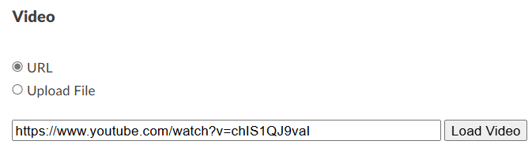
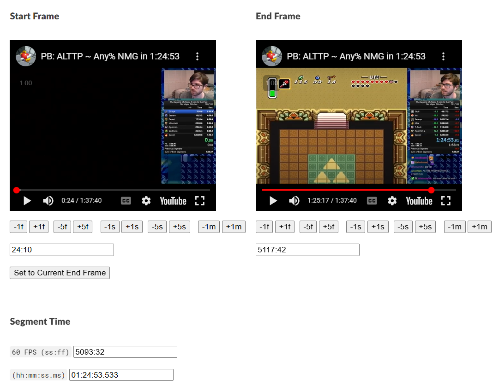
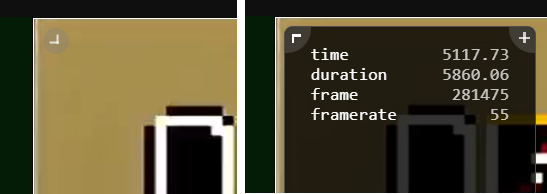
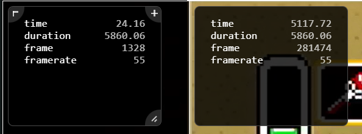
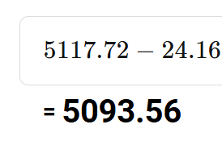
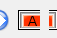
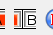
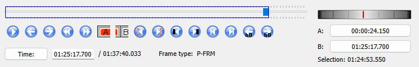

# How Runs Are Timed

All runs have a defined start and end point for determining the length of the run in an objective and reproducible way. Timing for a run is determined by inspecting the video and determining the duration between the frame on which timing starts and the frame on which timing ends. This page is meant to clarify exactly what frames those are and to explain how, specifically, to do the timing.

The start point for virtually all runs is on file select. Timing for this begins on **the first black frame after the file select menu**.

The end point for many runs, although by no means all, is on the transition to the Triforce room. Timing for this ends on **the darkened frame before the mosaic transition**.

See the [timing process](#timing-process) section if you want to see what tools and techniques I use to determine the length of a run.

Runs with other timing endpoints may be added to this document later.

# Example Frames For Any% NMG

These frames are all taken (with permission) from the YouTube upload of [Chexhuman's 1:24:53](https://www.youtube.com/watch?v=chIS1QJ9vaI).

You'll notice that I used three different methods of analyzing the same YouTube video and the three did not produce exactly the same result. This is confusing and frustrating! In general the discrepancy is less than 1 frame. Have a friend check your work if this matters in any specific case.

## First Frame

The following three images are the frame immediately before the frame on which timing starts, the frame on which timing starts, and the frame after which timing starts.

A couple things to notice here:

1. The frame immediately after timing starts is also a black frame, so you have to be careful when stepping through a video!
1. Chexhuman started his timer early, helpfully illuminating that the time Livesplit says at the end of a run is _not accurate_.

## Last Frame

The following three images are the frame immediately before the frame on which timing ends, the frame on which timing ends, and the frame immediately after the frame on which timing ends.

Some things to notice here:

1. The darkening frame doesn't have a mosaic effect. If you see the mosaic effect, you've gone at least one frame too far.
1. The darkening effect is pretty visible when stepping through a run, but somewhat harder to see here. I've included another image below that should make it clearer.
1. Chexhuman split early, once again demonstrating that Livesplit timing is not reliable! Thanks, Chexhuman 💖!

# Timing Process

I am once again working with [Chexhuman's 1:24:53](https://www.youtube.com/watch?v=chIS1QJ9vaI). I will explain a few ways to go about determining the duration of this video.

**NOTE:** In this example, the run turns out to be solidly in the middle of a second. If a run is extremely close to a second barrier (it has milliseconds around .00 or .99), you might want to get a second opinion or use multiple timing methods.

## VidTimer

This is a browser-based tool for determing the duration of a portion of an online video, which is super useful for us. Thanks to RequiemOfSpirit for teaching me about this.

First enter the URL of the video in the field for it and click `Load Video`.

Now you have two embeds of the video. I find that the tool works better once I click play on each of them. Then you can use a combination of scrubbing through the embed & pressing the navigation buttons to land on the first and last frames. This will then give you the total time.

## Frame by Frame

Another useful tool is the `Frame By Frame` browser extension ([Chrome](https://chromewebstore.google.com/detail/frame-by-frame/cclnaabdfgnehogonpeddbgejclcjneh), [Firefox](https://addons.mozilla.org/en-US/firefox/addon/frame-by-frame/)).

This gives us 2 useful tools: it shows precise video location in your browser, and it gives you new keyboard controls to move through a video frame by frame. By default, the left and right arrow keys move 1 frame backward/forward, and they only work when your mouse is hovering over a video.

It's worth noting here that, on YouTube, the `,` and `.` keys also move through the vod one frame at a time, which I find easier.

With Frame By Frame installed, you can hover over a video and and see a diagonal arrow in the topleft. You can click this to show a panel with precise information.

Now you can navigate to the start and end frames and do subtraction. In the case of our example, I'm getting the following values:

Some subtraction yields the following:

This is the number of seconds that the run is. Since we only time runs to the nearest second in ALttP, we can generally ignore any milliseconds portion (although if it's extremely close to a second barrier, you should exercise extra care).

## Local Analysis

If you'd like to investigate the video locally, you have a variety of tools available. We are at time of writing recommending a tool such as [Stacher7](https://stacher.io/) for downloading.

For analyzing the vod, I use [Avidemux](https://avidemux.sourceforge.net/download.html), but you could use other tools for the purpose. In Avidemux, first identify the start frame by using a combination of scrubbing and frame stepping (left and right arrow keys) and press the `[A` button in the UI:

Then navigate to the final frame and press the `][B` button in the UI:

If you did this right, youll have a selection of the run highlighted and the selection duration will be shown in the bottom right:

