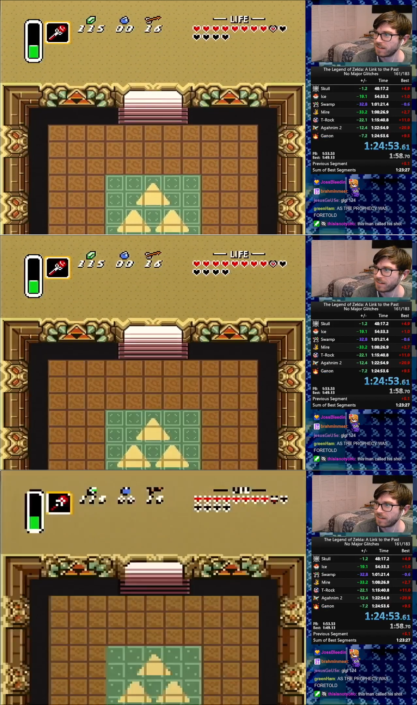

# How Runs Are Timed

All runs have a defined start and end point for determining the length of the run in an objective and reproducible way. Timing for a run is determined by inspecting the video and determining the duration between the frame on which timing starts and the frame on which timing ends. This page is meant to clarify exactly what frames those are and to explain how, specifically, to do the timing.

The start point for virtually all runs is on file select. Timing for this begins on **the first black frame after the file select menu**.

The end point for many runs, although by no means all, is on the transition to the Triforce room. Timing for this ends on **the darkened frame before the mosaic transition**.

See the [timing process](timing_process.md) page if you want to see what tools and techniques I use to determine the length of a run.

Runs with other timing endpoints may be added to this document later.

# Example Frames For Any% NMG

These frames are all taken (with permission) from the YouTube upload of [Chexhuman's 1:24:53](https://www.youtube.com/watch?v=chIS1QJ9vaI).

## First Frame

The following three images are the frame immediately before the frame on which timing starts, the frame on which timing starts, and the frame after which timing starts.

A couple things to notice here:

1. The frame immediately after timing starts is also a black frame, so you have to be careful when stepping through a video!
1. Chexhuman started his timer early, helpfully illuminating that the time Livesplit says at the end of a run is _not accurate_.

## Last Frame

The following three images are the frame immediately before the frame on which timing ends, the frame on which timing ends, and the frame immediately after the frame on which timing ends.

Some things to notice here:

1. The darkening frame doesn't have a mosaic effect. If you see the mosaic effect, you've gone at least one frame too far.
1. The darkening effect is pretty visible when stepping through a run, but somewhat harder to see here. I've included another image below that should make it clearer.
1. Chexhuman split early, once again demonstrating that Livesplit timing is not reliable! Thanks, Chexhuman 💖!

This image is edited with the left half being the normal colours and the right half being from the final, darkened frame:

# How To Time A Run

See the full [timing process page](timing_process.md) for info on how runs are timed in practice.
