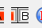

# Timing Process

I will explain a few ways to go about determining the duration of this video, using [Chexhuman's 1:24:53](https://www.youtube.com/watch?v=chIS1QJ9vaI) as an example.

**NOTE 1** In this example, the run turns out to be solidly in the middle of a second. If a run is extremely close to a second barrier (it has milliseconds around .00 or .99), you might want to get a second opinion or use multiple timing methods.

**NOTE 2** This example uses a 60fps capture. If you are working with a 30fps video (or a 60fps video that contains 30fps capture), the specific frames here may be missing. In this case, you should generally look for the frames on the "outside" of the run - i.e. the frame *before* the starting frame, and the frame *after* the ending frame.

You'll notice that I used three different methods of analyzing the same YouTube video and the three did not produce exactly the same result. This is confusing and frustrating! In general the discrepancy is less than 1 frame. Have a friend check your work if this matters in any specific case.

## VidTimer

[VidTimer](https://vidtimer.com/) is a browser-based tool for determing the duration of a portion of an online video, which is super useful for us. Thanks to RequiemOfSpirit for teaching me about this.

First enter the URL of the video in the field for it and click `Load Video`.

Now you have two embeds of the video. I find that the tool works better once I click play on each of them. Then you can use a combination of scrubbing through the embed & pressing the navigation buttons to land on the first and last frames. This will then give you the total time.

## Frame by Frame

Another useful tool is the `Frame By Frame` browser extension ([Chrome](https://chromewebstore.google.com/detail/frame-by-frame/cclnaabdfgnehogonpeddbgejclcjneh), [Firefox](https://addons.mozilla.org/en-US/firefox/addon/frame-by-frame/)).

This gives us 2 useful tools: it shows precise video location in your browser, and it gives you new keyboard controls to move through a video frame by frame. By default, the left and right arrow keys move 1 frame backward/forward, and they only work when your mouse is hovering over a video.

It's worth noting here that, on YouTube, the `,` and `.` keys also move through the vod one frame at a time, which I find easier.

With Frame By Frame installed, you can hover over a video and and see a diagonal arrow in the topleft. You can click this to show a panel with precise information.

Now you can navigate to the start and end frames and do subtraction. In the case of our example, I'm getting the following values:

Some subtraction yields the following:

This is the number of seconds that the run is. Since we only time runs to the nearest second in ALttP, we can generally ignore any milliseconds portion (although if it's extremely close to a second barrier, you should exercise extra care).

You can use a tool like [this one](https://www.browserling.com/tools/seconds-to-hms) to convert the number of seconds into a more readable hours, minutes, and seconds format.

## Local Analysis

If you'd like to investigate the video locally, you have a variety of tools available. We are currently recommending [Stacher7](https://stacher.io/) for downloading. Make sure you select to download the highest quality video available.

For analyzing the vod, I use [Avidemux](https://avidemux.sourceforge.net/download.html), but you could use other tools for the purpose. In Avidemux, first identify the start frame by using a combination of scrubbing and frame stepping (left and right arrow keys) and press the `[A` button in the UI:

Then navigate to the final frame and press the `][B` button in the UI:

If you did this right, youll have a selection of the run highlighted and the selection duration will be shown in the bottom right:

