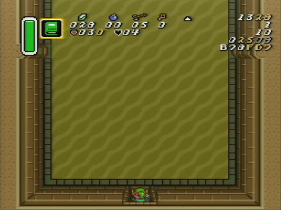

Fuck this room.

# Timing

81x on good RNG, 85x or so on bad RNG are good for me.

# What

There are cannons on each side of the room that fire cannonballs at you. When they start firing is based on a frame rule.\* You always want to dash up ASAP, and then the rest of the room splits; there are 2 things and you need to figure out which one to do.

## Main strats

1. Dash up, open chest, dash out. This is fast and free on the RNGs where it works.
2. Dash up, after you pass through the first 2 cannonballs, cancel dash and immediately redash. This requires walking down ~32 px (until Link's feet are on the sand) before dashing out on most RNGs. Dashing up and redashing randomly in the middle of the room actually works on a lot of patterns, too.

----

Strat 1 works on over half of the RNGs, depending on how fast you start your dash (you should be able to start the dash early enough for Strat 1 to work on about 18/32 RNGs). Strat 2 works on the rest, and you have a lot of leeway before the bottom cannonballs hit you on about half of these, too.

There's one weird strat where the first row of cannonballs is missing the right one. It's pretty easy to identify when you see it. You do strat #2 for this but you can dash down instantly instead of walking to the sand.

I don't have great cues for picking a strat. It's kinda by feel for me still, unfortunately. I also find positioning Link for the redash difficult on the ones where it's tight. You want to stand such that you are below the top cannonballs and below the bottom cannonballs, which is a fairly tight window.

# Excruciating detail

Going by the prachack RNG control, here's the scoop on each pattern:

* 00: Strat #1. There's like 20+ frames of leeway, too; it's super free
* 01: Strat #1. ~20 frames of leeway.
* 02: Strat #1. ~20 frames of leeway.
* 03: Strat #1. ~20 frames of leeway.
* 04: Strat #1. ~15 frames of leeway.
* 05: Strat #1. ~15 frames of leeway.
* 06: Strat #1. ~15 frames of leeway.
* 07: Strat #1. ~10 frames of leeway.
* 08: Strat #1. ~10 frames of leeway.
* 09: Strat #1. ~10 frames of leeway.
      Strat #2 also works.
* 0A: Strat #1. ~10 frames of leeway.
      Strat #2 also works.
* 0B: Strat #1. <10 frames of leeway.
      Strat #2 also works.
* 0C: Strat #1. <10 frames of leeway.
      Strat #2 also works but walk farther down than usual.
* 0D: Strat #1. <10 frames of leeway.
      Strat #2 also works but walk farther down than usual.
* 0E: Strat #1. <10 frames of leeway.
      Strat #2 also works but walk farther down than usual.
* 0F: Strat #1. <10 frames of leeway.
      Strat #2 also works but walk farther down than usual.
* 10: Strat #1. <10 frames of leeway, probably more like 5.
      Strat #2 also works.
* 11: Strat #1 works but it's _extremely_ tight.
      Strat #2 also works and is probably best in RTA.

* 12: Strat #2. 
      Strat #1 technically works but is not viable.
* 13: Strat #2.
      Strat #1 *can* work but I think it's a frame rule on whether you get hit by the cannonball or not.
* 14: Strat #2.
* 15: Strat #2.
* 16: Strat #2.
* 17: Strat #2.
* 18: Strat #2. This is about where doing the redash below the bottom of cannonballs stops being okay. You can do it, but it's tight, and you should dash below the top cannonballs instead.
* 19: Strat #2.
* 1A: Strat #2.
* 1B: Strat #2.
* 1C: Strat #2. This one has a lonely left cannonball. You can dash out immediately instead of walking down.

* 1D: Strat #1. Five billion years of leeway.
* 1E: Strat #1. Five billion years of leeway.
* 1F: Strat #1. Five billion years of leeway.

Thru 0D, if you dash when the bottom of Link's ear is lined up with with the top of the greyish tile inlay (FC6), you'll make the single dash up (possibly slightly subject to frame rules). Thru 0F this works with the top of link's ear lined up w/ top of inlay (FCC).

Thru 0E the dash up is much tighter than the dash down. If you make the single dash up, you're set to dash down immediately.

If you bonk on 00-07 you can open the chest and then dash down immediately as if you had gotten it right. At 08 this starts getting pretty tight. At 0B this doesn't work and you have to walk down pretty far (like, link's hat lines up with the start of the sand far) to dash out. Don't bonk!!

----

\* it's possible it's not a frame rule but I'm pretty sure
