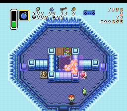

NOTE: this is a partial explanation right now, only covering the end of the room.

# Throwing the bomb

Throw the bomb down while aligned vertically with the fat rail. Horizontally you want to be between X-D82 and X-D87. Generally you will have the bomb in hand, line up with the left side of the right rail, and tap down to nudge into position.

You want the bomb to land sort of inside the wall, far enough right to hit the switch. It's pretty hard to mess up the vertical part - you have to throw from some weird range of pixels far above the rail - but the horizontal part takes some getting used to. Luckily, at least if you're doing the 2 bomb version, if you miss the switch you can just hit it in the conveyor room at a minor time cost.

# Standing After The Bomb Is In Place

Optimally you want to run into a bari right before the bomb explodes and then make it into position on the bombable floor to fall instantly when the bomb goes off. If the bari doesn't cooperate or it would cost you beams in conveyor room, simply walk into position on the pegs and wait.

Stand lined up with the right rail. This will drop you into the position you want to be in for the next room.

**DO NOT STAND TO THE LEFT**

Standing to the left _is not safer_. Bomb hitboxes are square, and the bomb hits all the way to the left side of the bombable floor, even if you throw it as far right as possible; i.e. you cannot be safe from it horizontally.

You can be safe from it vertically though! If the bomb lands in a normal place, it wont hit you if you stand on Y-25E or higher. This is about when Link's hat lines up with the top of the orange pegs.

You can see in this picture that the bomb hitbox extends too far left to be safe from horizontally. Link is standing at the bottom possible pixel in this image, there are many above it that are safe.

I personally aim to line Link's feet up with the bottom of the orange pegs and then don't worry if I'm up or down a couple pixels.

Once the switch is hit you can start holding down to fall in the hole ASAP.
