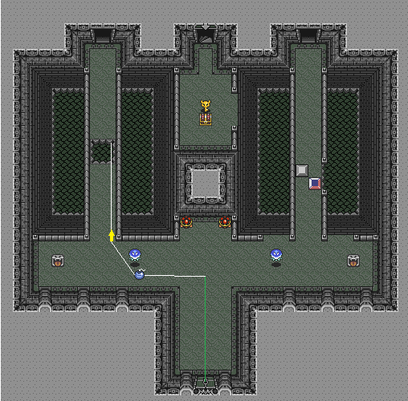

This is mostly a "Just Do The Inputs" room. [Watch Dom do it](https://api.strats.alttp.run/media/roomtimes/DomTurchi_junction-2.mp4) and try to copy him.

General path here:

# Timing

I want to see a 90x and am happy with any 91x.

# Menu

The menu is `>>>`.  I menu at the end of my walk left, to have a second to decide how to deal with the bari RNG. This isn't an important menu buffer; do it wherever you prefer.

If you have powder/shroom, you can do a 2-move menu instead of `>>>`. My recommendation is to do all possible menus as if you don't have powder/shroom unless you intend to never drop them.

[TODO: general philosophy writeup]

# What

Hold ^ and start a dash. Timing dashes in rooms where the first thing you do is dash is pretty important.

Cancel dash < about 1 big-tile (16px) [TODO: tile definitions] above the horizontal wall. 

There are 3 big protrusions (columns?) in the wall, with 2 big-tiles of regular wall between them. When you're approximately 1 big-tile away from the rightmost protrustion, place a bomb. Start walking <^ until you clear the rail, then throw the bomb up when your feet are just barely past the bottom of the horizontal rail. Continue walking up until you're lined up with the top big-tile of the bombable area.

[TODO: centralized discussion on picking up bombs]

# Why

The earlier you place the bomb, the earlier it explodes. The idea is to place the bomb as early as possible while still allowing you to throw it into place and get out of its blast radius. In real runs, you want several frames of leeway, because getting hit by your bomb is bad.

[TODO: explanation on why losing hearts is bad, with full dungeon context]

The goal for bombing the floor is to stand fully inside of the bombable floor when it opens, so you fall immediately. If you're high, you'll slip before you fall. If you're low, or your bomb is high, you'll take damage. Try to throw the bomb as low as you can, and then stand fully inside the floor to fall instantly. If you threw the bomb late, be aware and stand higher; losing a heart is worse than slipping for a few frames.

In particular, you want to fall as high as possible; you're waiting on the bomb fuse no matter what, and your goal in the next room as at the top, so you want to enter it high.

You can pick up bombs from kinda far behind you. A big part of getting this room fast is placing the bomb pretty early, walking almost a whole big-tile, and then picking it up (because walking is faster when you're not holding something).

[TODO: explanation on picking up bombs]

-----

Alternatively, you can cancel the first dash a little early and dash left instead of walking left. Then you want to cancel your second dash with an ^ input and place the bomb immediately. This is about 10 frames slower, so do it if you like it better.

-----

Bari RNG:

[TODO: learn]

There's a [blue bari](../../enemies/blue_bari.md) that can get in your way. I don't know what to do if it's maximally annoying, probably beam it? mostly you just walk a little further to the left and delay your bomb placement a little. The X coordinate you throw the bomb on doesn't matter (except that doing it as far right as possible is faster because you get there first), so +90% of the time you can just walk a few pixels to the left to get around it and do the room otherwise the same.

-----

Recovery:

There are 2 main ways to mess up. First is to cancel your dash late and walk into a turtle. The recovery here is to basically pretend that didn't happen, walk left and place your bomb as normal. If you normally do the dash-left strat, this will feel worse than if you normally do the walk-left strat.

The other way is to  place the bomb early, or else walk into the bari or get hit by a fireball. When this happens, there's two realistic possibilities:

1. you can get the bomb on top of the bombable floor before it blows up. this can be done by:
    1. throwing it but way higher than usual - in this case, just walk above the bbombable area and then walk back down after it opens, or, if you don't think you can, wait below the bombable area and then walk up into it when it opens.
    1. picking it back up and walking on top of the floor. this is good if you get hit by a fireball when you're too high to throw the bomb and have it land on the bombable area. This costs a heart and you get knocked back before the floor opens, so it's pretty bad, but better than dropping a whole new bomb.

If you can't get your first bomb to blow up the floor and need to place a second one, you want to walk < until Link is kissing the left rail, and then place a bomb. The bomb will look like it should fall, but it won't. You can then walk all the way > and kiss the right wall, and you will be outside the blast radius. This allows you to fall instantly when the floor opens. 

