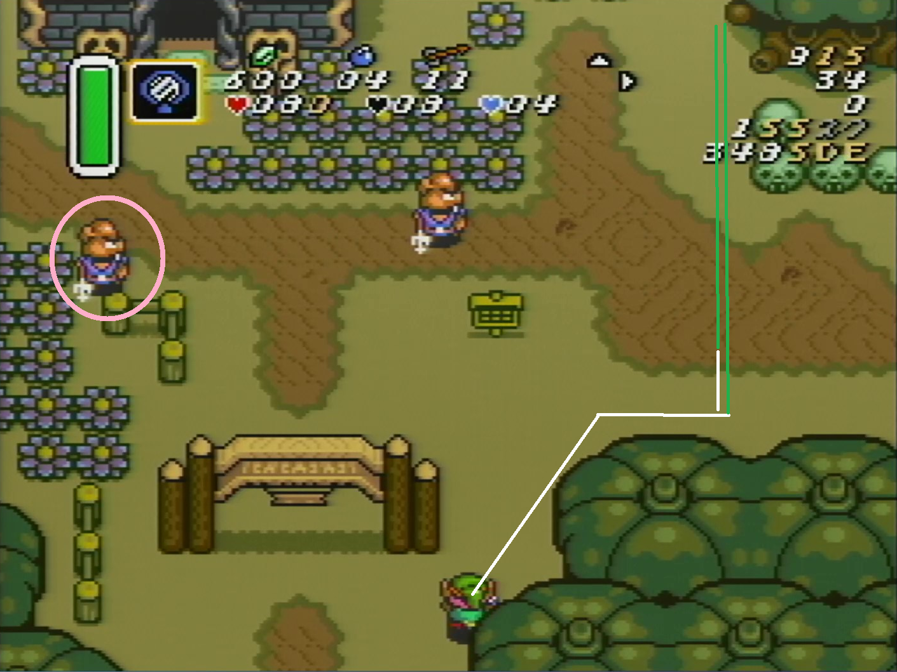
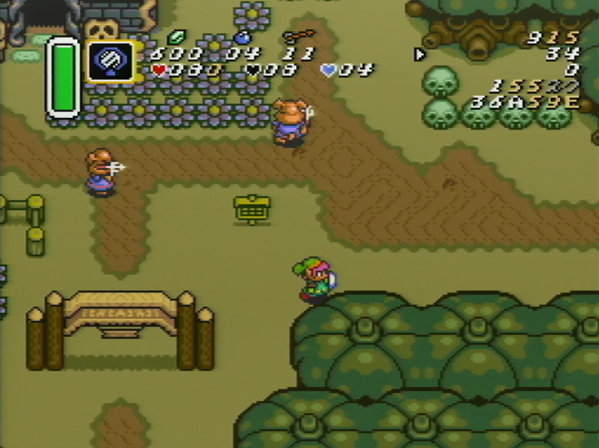
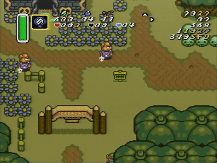

In this room, you walk into position while reading the [moblin](../../enemies/moblin.md) RNG, and then either dash up, or, on one RNG, walk up and then dash up.

General paths here, with the guy to watch circled:

When you get to the top of the room, cancel your dash as high as possible and walk into the transition.

# Timing

I don't really pay attention, but from doing it a few times <=520 is consistently doable on good rng, and 528-531 seems consistent on bad rng. Just do the strat and it'll be fine, there's not much to grind here.

# What

Transition as far right as possible on the previous screen. Hold ^> out of the transition until you round the tree, then hold >. You want to land on x-coord 390, but you can be several pixels off on either side and be fine, you just want to not bonk on either the skulls or the bit of cliff at the top. I use a visual cue with Link's shield.

When you get into position, you want to immediately dash up except for _one RNG_. This picture shows the RNG (Link is not yet far enough right; you have a good amount of walking time to read the RNG before you're in place).

If the moblin stops right there *and* lifts her spear, you have to walk up before you start your dash. The rest of the room is the same on all other RNGs, including, in particular, all other RNGs where she throws the spear at that height but more to the left or right.

I cannot stress enough the degree to which you do the same thing on _all RNGs except that one_. You are watching for one thing to happen, and if that thing doesn't happen you just dash straight up when link gets to the right position. If the moblin throws the spear from anywhere else, it will either go in front of you or behind you.

You can't always walk up to the dirt and then dash; that gets you hit on different RNG.

----

You can pump a few times at the beginning if you want.

If you dash too far to the left and luck out and don't get hit, you should keep the dash and cancel before you bonk into the cliff, take a step right, dash up and finish the room as normal.

Dashing too far to the right it's hard to say. If you notice you started your dash too far to the right, try to give it up, walk back into position and dash up, walking up a little if it looks like you'll get hit by a spear. If you notice too late it's probably gonna suck, so try to dash in the right place.
