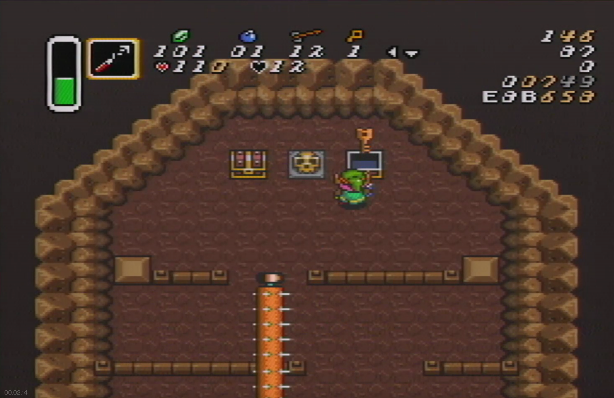
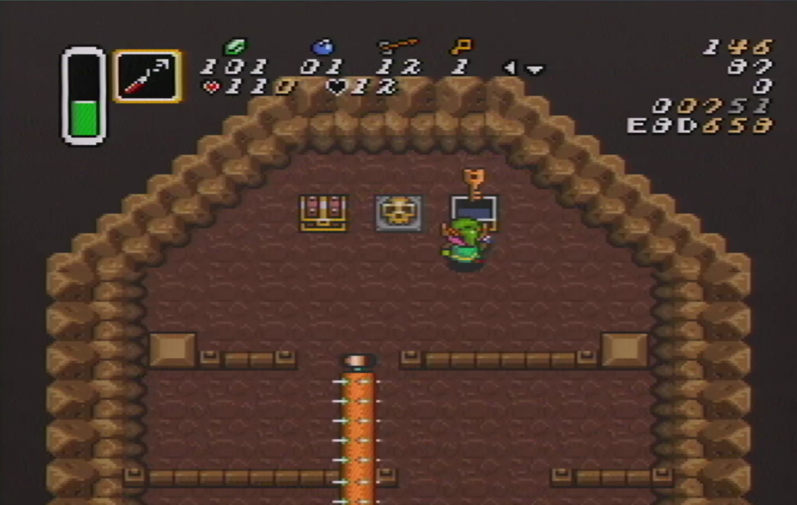

This is a semi-"Just Do The Inputs" room. There's no RNG, but you have to be able to react to how fast you were in the first half of the room to do the second half correctly.

# Timing

I want to see a 104x. Depending on how badly the first half goes, even an 112x or so is fine.

# Going Down

[Explanation/demo](https://www.twitch.tv/videos/682867807)

Check how far right the roller is when you're opening the chest.

You always want to walk <v around the top rail and then walk v, v> to clear the next rail, then start walking v. The idea is to get hit by the top roller, and then dash ASAP, which lets you dash straight through the bottom roller while you're still in iframes.

You need to adjust your walk < as you're going down depending on how fast you got to the chest. The slower you were opening the chest (as determined by how far right the top roller is when you open it), the more you have to adjust < before taking the dboost.

You can also take it easier by taking the dboost and then walking below the bottom roller. This allows you to either walk all the way out the door or dash after you're comfortably clear of the bottom roller, as you prefer.

Safe strat is getting the small key and then mirroring out. I have heard this costs ~4 seconds but I have not tested it myself. It also nets you another full magic, which makes magic management much nicer in the rest of the dungeon.

[TODO: TR magic management discussion]

If you do it about this fast, you can walk straight down and dash as soon as you get hit:

If you're around here, go <v like 1/2-3/4 a tile before dashing down:

You'll have to do it a bunch to get a feel for how far to adjust left before you take the first hit based on how fast you got to the chest.
